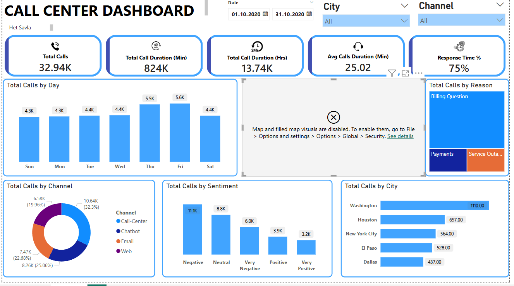

📞 Call Center Dashboard
This repository contains a Power BI call center dashboard created by Het to monitor and analyze call center performance over a selected period.

📊 Dashboard Overview
The dashboard provides key insights into the call center's operations, including:

Total Calls: 32.94K

Total Call Duration (Min): 824K

Total Call Duration (Hrs): 13.74K

Average Call Duration: 25.02 min

Response Time %: 75%

🚀 Features
Total Calls by Day: Visual bar chart of daily call volume.

Total Calls by Channel: Breakdown of calls handled via Call-Center, Chatbot, Email, and Web.

Total Calls by Sentiment: Distribution of sentiment (Negative, Neutral, Very Negative, Positive, Very Positive).

Total Calls by Reason: Reasons for calls like Billing Questions, Payments, and Service Outages.

Total Calls by State & City: Geographic distribution of calls with map visualization.

Date Range Filter: Custom date selection to filter data.

City & Channel Filters: Dynamic filters for granular analysis.

🛠 Technologies
Power BI (for data visualization)

Microsoft Bing Maps (for geographic visuals)

📸 Dashboard Preview

💡 Usage
1️⃣ Open the .pbix file in Power BI Desktop.
2️⃣ Update the data source connections as per your dataset.
3️⃣ Explore different views using slicers for city, channel, and date.

⚡ How to Run
If you have the Power BI file:

bash
Copy
Edit
1. Open Power BI Desktop.
2. Load `Call Center Dashboard.pbix`.
3. Refresh the data if needed.
4. Interact with slicers and visuals.
📌 Author
Het
